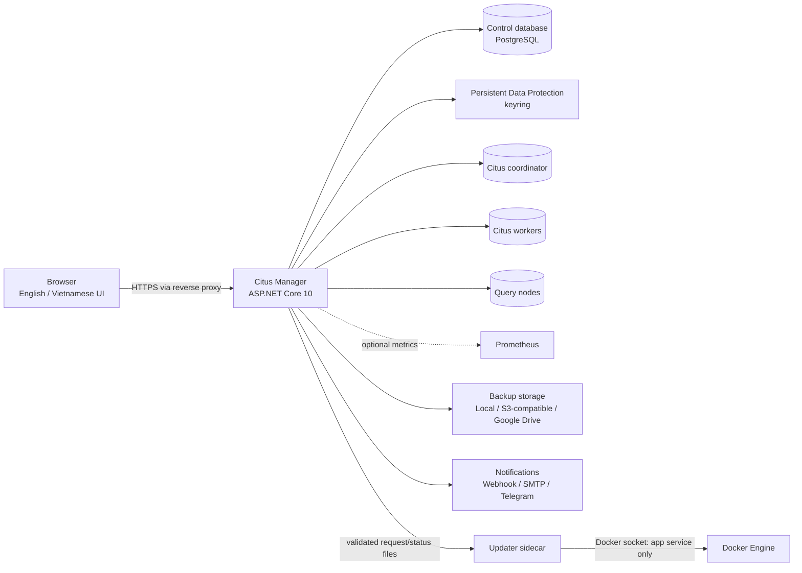

# Citus Manager

> A self-hosted web control plane for operating existing PostgreSQL/Citus clusters with safer, observable workflows.

[English](README.md) · [Tiếng Việt](README_VI.md)


Citus Manager is a self-hosted control plane for existing Citus deployments. It centralizes cluster inventory, topology operations, database administration, monitoring, and logical backup/restore in a single web interface. Its operation model provides immutable plans, live preflight validation, progress tracking, access control, and audit records for high-impact changes.

> **Public Beta:** production use requires staging validation, verified backups, direct monitoring, and an established change-management process. Citus Manager can execute topology changes and arbitrary PostgreSQL statements within the privileges of each configured database role.

## Contents

- [Overview](#overview)
- [Features](#features)
- [Architecture](#architecture)
- [Screenshots](#screenshots)
- [Project status](#project-status)
- [Compatibility](#compatibility)
- [Quick start with Docker Compose](#quick-start-with-docker-compose)
- [Application updates](#application-updates)
- [Running from source](#running-from-source)
- [API and OpenAPI](#api-and-openapi)
- [Testing](#testing)
- [Non-goals](#non-goals)
- [Roadmap and support](#roadmap-and-support)
- [Contributing and security](#contributing-and-security)
- [License](#license)

## Overview

Administration of distributed PostgreSQL commonly spans Citus functions, catalog queries, shell tools, monitoring systems, and organization-specific runbooks. Citus Manager consolidates these workflows while preserving their operational safety boundaries:

- Centralized inventory for multiple clusters, coordinators, workers, and query nodes.
- Inspectable, immutable plans for topology changes.
- Runtime capability discovery from database catalogs and installed function signatures.
- Persistent checkpoints, cancellation/recovery state, and sanitized audit records in a separate control database.
- Role-based interfaces for viewers, operators, and administrators.
- English and Vietnamese user interfaces.

## Features

### Fleet and topology operations

- Register and manage multiple existing Citus clusters.
- Inspect coordinators, workers, query endpoints, node state, metadata, distributed tables, shards, and placements.
- Add workers or query nodes, preview/run rebalance work, drain workers, and safely retire or remove nodes.
- Keep add-node and rebalance separate: adding a worker never silently starts a rebalance.

### Safety-oriented operation engine

- Read-only capability scan by PostgreSQL/Citus version, catalog, and function signature.
- Immutable plan followed by live preflight immediately before execution.
- PostgreSQL advisory lock limiting a cluster to one impact operation at a time.
- Durable checkpoints, progress polling, cancellation requests, and explicit `RecoveryRequired` outcomes.
- Refusal to remove a worker while placements remain. A lost worker with a unique shard is surfaced as recovery work, not a successful removal.

### Database workbench

- Browse schemas and objects from a tree workspace.
- Read logical tables through the coordinator or physical shard placements directly on a topology node.
- Page, filter, sort, insert, edit, and delete rows when the database role and object shape allow it.
- Import/export CSV and inspect placement for a selected row.
- Design schemas, tables, columns, constraints, and indexes.
- Create or convert local, reference, and distributed tables; configure distribution column, colocation, and shard count.
- Work with PostgreSQL partitioning, merge partitions, and rebuild indexes through preflighted operations.

### SQL console

- CodeMirror PostgreSQL editor with formatting and context-aware autocomplete.
- Risk classification and explicit confirmation before execution.
- Streamed results with configurable timeout and limits.
- Audit stores a SHA-256 fingerprint and execution metadata—not SQL plaintext or parameter values.

The console uses the control coordinator by default. Parser-proven read-only work may route to a healthy synchronized query endpoint, and an explicitly selected worker target is read-only. Coordinator execution does not restrict PostgreSQL statement types. Effective permissions are defined by the database role in the cluster profile. Production profiles should follow least-privilege access; each confirmation represents an actual database change boundary.

### Monitoring and alerts

- Built-in SQL collection for node availability, metadata synchronization, placements, shard size, and table counts.
- Optional Prometheus signals for target, CPU, memory, and filesystem state.
- In-app alerts with acknowledgement plus retrying webhook and SMTP delivery.
- Defaults: 60-second SQL polling and 30-day raw metric retention; both are configurable.

### Logical backup and restore

- On-demand and scheduled logical backups with retention, pinning, progress, retries, and restore workflows.
- Local, S3-compatible (including R2), and Google Drive destinations.
- Email and Telegram backup notifications.
- Optional AES-GCM artifact encryption, authenticated manifests, checksums, and restore-time integrity validation.
- PostgreSQL backup tool selection by server major version.

Logical dumps are not replacements for physical backup, WAL archiving, point-in-time recovery, or a tested disaster-recovery plan.

### Access and audit

- `Viewer`: dashboards, topology, database explorer/SQL, metrics, activity, and alerts.
- `Operator`: create/queue permitted plans, manage operational profiles, acknowledge alerts, and request cancellation.
- `Admin`: user, profile, backup, and audit administration plus all permitted operations.
- Cluster passwords, Prometheus tokens, storage credentials, and notification secrets are protected with ASP.NET Core Data Protection and never returned by the API.

### Application updates

- The Workspace sidebar displays the running application version for every authenticated user.
- Administrators can check GHCR for a newer timestamped release and start an application-only update from the web interface.
- Before restarting the application, the official Compose updater creates a logical backup of the control database and archives the Data Protection keyring.
- An update is refused while a cluster operation, backup, restore, or SQL execution is active.

## Architecture



The separate control database stores users, encrypted connection profiles, plans, checkpoints, monitoring samples, alerts, and audit metadata. Citus Manager connects to cluster nodes using configured profiles; it does not become part of the Citus data path.

## Screenshots

**Coming soon.**

## Project status

Citus Manager is a **Public Beta**. Core workflows are implemented and covered by automated tests, but APIs, UI behavior, migrations, and operational guarantees may change before a stable release. Production operation requires staging rehearsal, verified backups, and direct monitoring.

## Compatibility

**Validated with PostgreSQL 18 and Citus 14.** This is the combination successfully tested by the project owner.

The container includes PostgreSQL client toolchains for majors 14–18 so backup jobs can select compatible `pg_dump`/`pg_restore` binaries. Their presence does **not** mean every server combination in that range is validated. A live capability scan blocks operations when required functions, signatures, or metadata are unavailable.

## Quick start with Docker Compose

Requirements: Docker Engine/Desktop with Docker Compose and an existing, network-reachable Citus coordinator.

### Install with one command

Linux or macOS:

```bash
curl -fsSL https://raw.githubusercontent.com/int04/citus-manager/master/scripts/install.sh | sh
```

Windows PowerShell:

```powershell
irm https://raw.githubusercontent.com/int04/citus-manager/master/scripts/install.ps1 | iex
```

The installer verifies Docker Compose, creates `~/citus-manager`, downloads `compose.yaml`, generates a random 256-bit control-database password in `.env`, starts the stack, and prints its status. Subsequent executions reconcile the stack without replacing the stored password. An alternative location can be defined through `CITUS_MANAGER_INSTALL_DIR`.

Installer sources are available in [`install.sh`](scripts/install.sh) and [`install.ps1`](scripts/install.ps1) for security review.

### Finish setup

Compose starts Citus Manager and its private PostgreSQL control database, waits for health, and applies EF Core migrations. The control database is not published to the host or LAN.

Initial administration is available at <http://localhost:2706/Account/Setup>. Setup consists of creating the first `Admin` account and registering an existing coordinator. A Citus instance on the Docker host is addressed through `host.docker.internal`; remote clusters require a DNS name or IP address reachable from the application container.

### Operate and upgrade

Management commands run from the installation directory:

```bash
cd ~/citus-manager
docker compose logs -f app
docker compose pull
docker compose up -d
docker compose down
```

Production deployments can pin a published release instead of `latest` through `~/citus-manager/.env`. `<release-tag>` represents an existing published tag:

```dotenv
CITUS_MANAGER_IMAGE=ghcr.io/int04/citus-manager:<release-tag>
```

Named volumes `postgres_data`, `app_keys`, `backup_data`, `backup_spool`, and `update_state` survive recreation and normal `docker compose down`. Pre-update recovery artifacts are stored in the installation directory at `update-backups/`.

## Application updates

The official one-command installation includes an updater sidecar. Existing installations created before this feature must run the one-command installer once more to install the updated Compose definition. This reconciliation preserves the generated control-database password and persistent volumes.

The Workspace sidebar shows the installed version below **Sign out**. Administrators can refresh the release check and select **Update now** when a newer compatible timestamped release is available. The updater pulls the exact release tag, validates its update-protocol and Compose-generation labels, backs up the control database and keyring, updates `CITUS_MANAGER_IMAGE`, and recreates only the `app` service. The control PostgreSQL service is not upgraded.

Update safeguards:

- The application rejects concurrent updates and updates attempted during active cluster operations, backups, restores, or SQL executions.
- Update backups are stored under `~/citus-manager/update-backups`; the newest three sets are retained. Each set contains the control-database dump, keyring archive, and previous image reference.
- The application may be unavailable for up to three minutes while the new container becomes healthy. EF Core migrations run through the configured startup migration behavior.
- Automatic rollback is not attempted after a failed health check because the new release may already have migrated the control schema.
- Releases that require a different Compose generation are blocked. Run the one-command installer again to update the deployment definition.

The updater is intentionally isolated from application networking, but it mounts `/var/run/docker.sock` to recreate the application container. Access to the installation host and directory must therefore be restricted to trusted administrators. The Citus Manager application container remains read-only, non-root, and has no Docker socket.

If an update fails, inspect `docker compose logs updater app` and the status shown in the sidebar. Preserve the corresponding `update-backups/<request-id>` directory. Restore the control-database dump and Data Protection keyring together as part of a controlled recovery; do not start an older image against a migrated schema unless its compatibility has been verified.

> **Destructive command:** `docker compose down -v` deletes every named volume in this stack, including the control database, keyring, and local backups. Do not run it unless deletion is intended and recoverable from a verified backup.

> **Password rotation:** changing only `CITUS_MANAGER_DB_PASSWORD` after PostgreSQL initializes does not change the role password in the existing volume and can lock the app out. Rotate the database role password and application setting together through a controlled procedure.

### Production checklist

- TLS termination at a trusted reverse proxy; no direct HTTP exposure to untrusted networks.
- Firewall or private-network access limited to required database, Prometheus, storage, and notification endpoints.
- Persistent, protected storage for `app_keys`; coordinated backup and restore of the control database and keyring.
- Regular backup and restore validation for local storage destinations.
- Dedicated least-privilege cluster roles, with topology and DDL privileges granted only where required.
- Secret injection through protected environment configuration or a secret manager.
- Pinned releases and upgrade rehearsal in staging.
- Restricted host access because the updater sidecar has Docker socket access.

## Running from source

Requirements: .NET SDK 10, a separate PostgreSQL control database, and an existing configured PostgreSQL/Citus cluster. Node.js/npm is needed only to rebuild the bundled SQL editor.

Configure secrets using environment variables. PowerShell example:

```powershell
$env:ConnectionStrings__ControlDatabase='Host=localhost;Port=5432;Database=citus_manager;Username=citus_manager;Password=<SECRET>;SSL Mode=Prefer'
$env:Database__AutoCreateSchema='true'
$env:Security__DataProtectionKeyPath='D:\protected\citus-manager-keys'
```

```powershell
dotnet restore
dotnet run --launch-profile http
```

The development setup endpoint is <http://localhost:5115/Account/Setup>. `Database__AutoCreateSchema=true` enables automatic migrations. The official Compose deployment sets this option to `true`, so migrations also run automatically when the application starts after an update. Custom deployments may disable it only when migrations are applied separately as part of their release procedure.

Rebuild the SQL editor only when its client source changes:

```bash
npm ci
npm run build:query-console
```

## API and OpenAPI

Development OpenAPI is available at `/openapi/v1.json`. [`CitusManager.http`](CitusManager.http) covers principal API areas, [`QueryConsole.http`](QueryConsole.http) contains query-console examples, and [`SystemUpdate.http`](SystemUpdate.http) documents the update endpoints. Preserve authentication, authorization, anti-forgery, and secret-handling controls in integrations.

## Testing

```powershell
dotnet test CitusManager.sln --configuration Release --no-restore
docker compose config --quiet
```

The documented baseline is **223 passed, 0 failed, 0 skipped**. These are repository tests, not a claim of live-cluster integration coverage. PostgreSQL 18/Citus 14 compatibility is based on the owner's validated environment.

Additional checks:

```powershell
dotnet build CitusManager.sln --configuration Release
dotnet list package --vulnerable --include-transitive
```

## Non-goals

Citus Manager does not:

- Provision VMs, containers, PostgreSQL instances, coordinators, or workers.
- Configure DNS, routing, firewalls, TLS, PostgreSQL authentication, or `pg_hba.conf`.
- Replace HA/failover, physical backup, WAL archiving, or PITR.
- Repair lost unique shard data or make unsafe removal recoverable.
- Remove the need for staging rehearsals, capacity planning, monitoring, or database expertise.

## Roadmap and support

[GitHub Issues](https://github.com/int04/citus-manager/issues) tracks reproducible defects, feature proposals, compatibility reports, and roadmap discussion. Reports should include application and PostgreSQL/Citus versions, sanitized context, expected and actual behavior, and reproducible steps. Secrets, sensitive SQL, and vulnerability details are excluded from public reports.

This project is an open-source **Public Beta**. There is no commercial support or uptime commitment unless separately stated by a maintainer.

## Contributing and security

Contribution requirements are defined in [`CONTRIBUTING.md`](CONTRIBUTING.md) and [`CODE_OF_CONDUCT.md`](CODE_OF_CONDUCT.md). Vulnerability reports follow the private process documented in [`SECURITY.md`](SECURITY.md).

## License

Citus Manager is released under the [Zero-Clause BSD license](LICENSE). See [`THIRD_PARTY_NOTICES.md`](THIRD_PARTY_NOTICES.md) for separately licensed dependencies and bundled assets.

## Acknowledgements

Built on [PostgreSQL](https://www.postgresql.org/), [Citus](https://www.citusdata.com/), ASP.NET Core, Entity Framework Core, Npgsql, CodeMirror, and other open-source projects listed in the third-party notices.

PostgreSQL and Citus names and marks belong to their owners. Citus Manager is an independent community project and is not affiliated with, endorsed by, or supported by the PostgreSQL Global Development Group or Microsoft.
