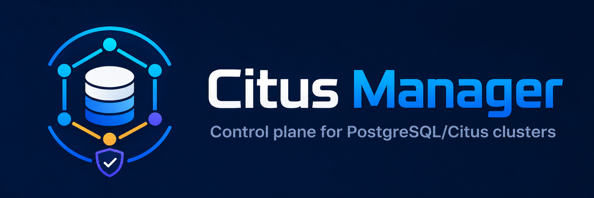
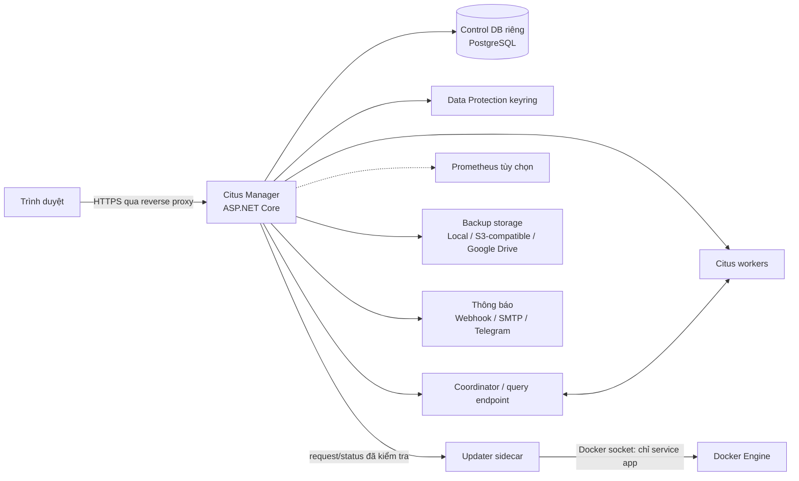

# Citus Manager



> Control plane web tự host để vận hành nhiều cụm PostgreSQL/Citus hiện có theo quy trình an toàn, có thể quan sát và kiểm toán.

[English](README.md) | **Tiếng Việt**

[](#trạng-thái-dự-án)
[](https://dotnet.microsoft.com/)
[](#khả-năng-tương-thích)
[](#khởi-chạy-nhanh-bằng-docker)
[](LICENSE)

Citus Manager là control plane web tự host dành cho các Citus cluster đã tồn tại. Ứng dụng hợp nhất inventory, topology operation, quản trị database, monitoring và logical backup/restore trong một giao diện. Mô hình operation sử dụng plan bất biến, live preflight, theo dõi tiến độ, phân quyền và audit cho các thay đổi có tác động cao.

Dự án phù hợp với DBA, platform engineer, SRE và đội phát triển đang tự quản lý một hoặc nhiều cụm Citus. Citus Manager **không tạo cụm mới**: coordinator, worker, mạng, TLS và cơ chế xác thực phải sẵn sàng trước khi đăng ký vào ứng dụng.

## Mục lục

- [Tổng quan](#tổng-quan)
- [Tính năng chính](#tính-năng-chính)
- [Kiến trúc](#kiến-trúc)
- [Ảnh chụp màn hình](#ảnh-chụp-màn-hình)
- [Khả năng tương thích](#khả-năng-tương-thích)
- [Khởi chạy nhanh bằng Docker](#khởi-chạy-nhanh-bằng-docker)
- [Cập nhật ứng dụng](#cập-nhật-ứng-dụng)
- [Checklist production](#checklist-production)
- [Phát triển từ mã nguồn](#phát-triển-từ-mã-nguồn)
- [API và OpenAPI](#api-và-openapi)
- [Kiểm thử](#kiểm-thử)
- [Giới hạn phạm vi](#giới-hạn-phạm-vi)
- [Đóng góp, bảo mật và giấy phép](#đóng-góp-bảo-mật-và-giấy-phép)

## Tổng quan

Quản trị PostgreSQL phân tán thường bao gồm Citus function, catalog query, shell tool, monitoring system và runbook riêng. Citus Manager hợp nhất các workflow này nhưng vẫn giữ nguyên ranh giới an toàn vận hành.

Các khả năng chính:

- Hiển thị nhiều cluster, node, database và trạng thái vận hành tại một nơi.
- Chuyển thay đổi có tác động thành plan bất biến, preflight trực tiếp và các checkpoint có thể kiểm toán.
- Phân loại rủi ro, yêu cầu xác nhận và giữ quyền quyết định cuối cùng ở database role thực tế.
- Theo dõi operation dài hạn, cancellation và trạng thái cần phục hồi thay vì che giấu kết quả chưa hoàn tất.
- Giảm việc ghép nối script riêng lẻ cho topology, dữ liệu, monitoring, backup và restore.

## Tính năng chính

### Quản lý nhiều cluster và topology

- Đăng ký nhiều Citus cluster đã tồn tại qua coordinator; thu thập inventory và capability theo database, phiên bản và chữ ký hàm thực tế.
- Hiển thị coordinator, worker và query endpoint; hỗ trợ worker có shard và node truy vấn không nhận shard.
- Thêm node, xem trước rebalance, chạy rebalance nền, drain placement rồi retire worker có kiểm tra an toàn.
- Không giả định worker mới sẽ tự nhận dữ liệu hiện có; rebalance là bước riêng, có chủ đích.

### Operation engine hướng an toàn

- Luồng chuẩn: capability scan → plan bất biến → preflight trực tiếp → hàng đợi → runner → checkpoint.
- PostgreSQL advisory lock giới hạn một impact operation trên mỗi cluster.
- Plan hash, trạng thái bền vững, tiến độ, audit và yêu cầu cancel giúp operation dài hạn có thể quan sát được.
- Drain bị hủy không đảo ngược shard đã di chuyển; retire luôn bị chặn nếu còn distributed placement.
- Node mất kết nối nhưng còn shard placement duy nhất chuyển sang `RecoveryRequired`; ứng dụng không giả vờ rằng remove node có thể phục hồi dữ liệu.

### Database Workbench

- Object tree cho database, schema, table, view, partition, index và các đối tượng liên quan.
- Duyệt bảng logic qua coordinator hoặc xem physical shard placement trực tiếp trên node topology.
- Data grid có phân trang, lọc/sắp xếp, chỉnh sửa/thêm/xóa row theo quyền database, export CSV và row inspector.
- Hiển thị vị trí row/shard để giải thích dữ liệu đang được định tuyến đến đâu.

### SQL console

- Trình soạn thảo CodeMirror với tô màu cú pháp, autocomplete, tìm kiếm và format SQL.
- Phân tích từng statement thành `ReadOnly`, `Write` hoặc `Destructive`; statement ghi/xóa cần xác nhận rõ ràng.
- Kết quả được stream, có giới hạn timeout, số result set, số row và kích thước cell để bảo vệ UI.
- Audit chỉ lưu hash SHA-256 và metadata thực thi; không lưu SQL plaintext hoặc parameter value.
- Mặc định console dùng control coordinator; truy vấn đã được parser chứng minh read-only có thể được chuyển tới query endpoint khỏe/đồng bộ, còn worker target được chọn trực tiếp luôn ở chế độ read-only.
- Trên coordinator, SQL console có thể chạy mọi statement mà database role của cluster profile cho phép. Xem kỹ [cảnh báo an toàn](#cảnh-báo-an-toàn).

### Thiết kế schema và vòng đời table

- Tạo table thường hoặc table partitioned; hỗ trợ RANGE, LIST và HASH partition workflow.
- Chuyển đổi giữa local, reference và distributed table với distribution column, colocation và shard count phù hợp.
- Tạo range partition theo plan, merge partition, kiểm tra table và rebuild index.
- Các thao tác thay đổi table đi qua cùng operation engine, capability check và risk model như topology operation.

### Monitoring và cảnh báo

- SQL collector theo dõi node activity, metadata sync, placement, shard bytes và table count; mặc định poll mỗi 60 giây, giữ dữ liệu thô 30 ngày.
- Tích hợp Prometheus tùy chọn để bổ sung trạng thái target cùng số liệu CPU, RAM và filesystem tổng hợp.
- Cảnh báo trong ứng dụng; gửi webhook hoặc SMTP với retry có giới hạn.
- Diagnostic tốn nhiều kết nối như kiểm tra sức khỏe pairwise không bị poll liên tục.

### Backup và restore logic

- Sao lưu logic từ coordinator, chạy ngay hoặc theo lịch; có retention, pin và tiến độ theo từng phase.
- Đích lưu trữ local, S3-compatible và Google Drive; hỗ trợ nhiều bản sao destination cùng quy trình repair.
- Artifact được mã hóa theo frame, kiểm tra integrity/checksum và xác thực manifest trước restore.
- Restore nhiều phase vào target đã kiểm tra; cancellation sau khi target bị thay đổi được đánh dấu `RecoveryRequired`.
- Thông báo backup/restore qua email SMTP hoặc Telegram.
- Container tích hợp PostgreSQL client 14–18 để chọn đúng backup/restore toolchain; đây không phải tuyên bố hỗ trợ mọi server combination.

### Truy cập, audit và bản địa hóa

- RBAC gồm `Viewer`, `Operator`, `Admin`.
- `Viewer`: xem dashboard, topology, dữ liệu/SQL, metric, activity và alert; khả năng ghi SQL vẫn do database role quyết định.
- `Operator`: đăng ký profile, lập/chạy operation, xác nhận alert và yêu cầu cancel.
- `Admin`: quản lý user/profile, audit và các hành động quản trị nhạy cảm.
- Cluster credential, storage secret và notification secret được mã hóa bằng ASP.NET Core Data Protection; không trả lại qua API, log hoặc audit.
- Giao diện và validation hỗ trợ English (`en-US`) và Tiếng Việt (`vi-VN`).

### Cập nhật ứng dụng

- Sidebar Workspace hiển thị phiên bản ứng dụng đang chạy cho mọi user đã đăng nhập.
- Admin có thể kiểm tra release timestamp mới trên GHCR và bắt đầu cập nhật riêng ứng dụng từ giao diện web.
- Trước khi khởi động lại ứng dụng, updater của bộ Compose chính thức tạo logical backup cho control DB và archive Data Protection keyring.
- Update bị từ chối khi cluster operation, backup, restore hoặc SQL execution đang chạy.

## Kiến trúc



Control DB chỉ lưu cấu hình, trạng thái operation, metric, audit và metadata của Citus Manager. Nó không chứa dữ liệu ứng dụng trong cluster được quản lý. Mỗi cluster profile kết nối đến coordinator hoặc query endpoint bằng credential đã mã hóa; quyền PostgreSQL của credential đó vẫn là lớp kiểm soát cuối cùng.

## Ảnh chụp màn hình

**Sắp cập nhật.**

## Trạng thái dự án

Citus Manager đang ở trạng thái **Public Beta**. Các workflow chính đã hoạt động và có test tự động, nhưng API, UI, migration và đặc tính vận hành có thể thay đổi trước bản ổn định. Môi trường production yêu cầu staging rehearsal, backup đã kiểm chứng và giám sát trực tiếp.

## Khả năng tương thích

**Đã xác thực thành công với PostgreSQL 18 và Citus 14.**

Ứng dụng phát hiện capability thực tế của database và chặn feature khi hàm/chữ ký cần thiết không tồn tại. Image chứa `postgresql-client-14` đến `postgresql-client-18` chỉ để phục vụ backup toolchain theo major version. Điều đó **không** đồng nghĩa mọi tổ hợp PostgreSQL/Citus 14–18 đều đã được chứng nhận.

Môi trường khác tổ hợp đã xác thực cần được kiểm thử riêng trên staging trước khi chạy operation có tác động.

## Khởi chạy nhanh bằng Docker

Yêu cầu: Docker Engine hoặc Docker Desktop có Docker Compose v2 và một Citus coordinator đã tồn tại, container có thể kết nối tới.

### Cài đặt bằng một lệnh

Linux hoặc macOS:

```bash
curl -fsSL https://raw.githubusercontent.com/int04/citus-manager/master/scripts/install.sh | sh
```

Windows PowerShell:

```powershell
irm https://raw.githubusercontent.com/int04/citus-manager/master/scripts/install.ps1 | iex
```

Installer kiểm tra Docker Compose, tạo thư mục `~/citus-manager`, tải `compose.yaml`, sinh mật khẩu control DB ngẫu nhiên 256-bit vào `.env`, khởi chạy stack và hiển thị trạng thái. Các lần chạy tiếp theo đồng bộ stack mà không thay thế mật khẩu đã lưu. Thư mục cài đặt khác có thể được khai báo qua `CITUS_MANAGER_INSTALL_DIR`.

Mã nguồn installer có tại [`install.sh`](scripts/install.sh) và [`install.ps1`](scripts/install.ps1) để phục vụ security review.

### Hoàn tất thiết lập

Trang khởi tạo có tại <http://localhost:2706/Account/Setup>. Quy trình gồm tạo tài khoản `Admin` đầu tiên và đăng ký coordinator hiện có.

- Citus chạy trên cùng Docker host: dùng `host.docker.internal`.
- Citus chạy từ xa: dùng DNS/IP mà container `app` có thể truy cập.
- Compose chỉ tạo PostgreSQL **control DB**; nó không tạo coordinator hoặc worker Citus.

### Vận hành và nâng cấp

Chạy lệnh quản lý từ thư mục cài đặt:

```bash
cd ~/citus-manager
docker compose logs -f app
docker compose pull
docker compose up -d
docker compose down
```

Image production có thể được khóa vào một release cụ thể qua `~/citus-manager/.env`:

```dotenv
CITUS_MANAGER_IMAGE=ghcr.io/int04/citus-manager:<RELEASE_TAG>
```

Các named volume:

| Volume | Nội dung |
|---|---|
| `postgres_data` | Control DB |
| `app_keys` | Data Protection keyring dùng để giải mã secret |
| `backup_data` | Artifact backup local |
| `backup_spool` | Vùng tạm cho backup/restore |
| `update_state` | Trạng thái trao đổi với updater |

## Cập nhật ứng dụng

Bản cài đặt một lệnh chính thức bao gồm updater sidecar. Bản cài cũ được tạo trước tính năng này cần chạy lại lệnh installer một lần để nhận Compose definition mới. Quá trình đồng bộ giữ nguyên mật khẩu control DB đã sinh và các persistent volume.

Sidebar Workspace hiển thị phiên bản bên dưới nút **Đăng xuất**. Admin có thể làm mới kết quả kiểm tra release và chọn **Cập nhật ngay** khi có release timestamp mới tương thích. Updater tải đúng release tag, xác minh label update protocol và Compose generation, backup control DB cùng keyring, cập nhật `CITUS_MANAGER_IMAGE`, rồi chỉ tạo lại service `app`. Service PostgreSQL control DB không được nâng cấp.

Cơ chế bảo vệ update:

- Ứng dụng từ chối update đồng thời hoặc update khi cluster operation, backup, restore hay SQL execution đang chạy.
- Backup trước update được lưu tại `~/citus-manager/update-backups`; chỉ giữ ba bộ mới nhất. Mỗi bộ gồm control DB dump, keyring archive và tham chiếu image trước đó.
- Ứng dụng có thể tạm ngừng tối đa ba phút trong khi container mới đạt trạng thái healthy. EF Core migration chạy theo cấu hình migration khi khởi động.
- Hệ thống không tự rollback sau health-check failure vì release mới có thể đã migrate control schema.
- Release yêu cầu Compose generation khác sẽ bị chặn. Chạy lại installer một lệnh để cập nhật deployment definition.

Updater bị cô lập khỏi network của ứng dụng nhưng mount `/var/run/docker.sock` để tạo lại application container. Vì vậy chỉ admin tin cậy được quyền truy cập host và thư mục cài đặt. Application container của Citus Manager vẫn chạy read-only, non-root và không có Docker socket.

Nếu update thất bại, kiểm tra `docker compose logs updater app` và trạng thái trên sidebar. Giữ nguyên thư mục `update-backups/<request-id>` tương ứng. Control DB dump và Data Protection keyring phải được restore cùng nhau trong quy trình recovery có kiểm soát; không chạy image cũ với schema đã migrate nếu chưa xác minh compatibility.

### Cảnh báo an toàn

> **Không chạy `docker compose down -v` nếu chưa có backup đã được kiểm chứng.** Lệnh này xóa toàn bộ named volume của stack, gồm control DB, keyring và backup local. Mất `app_keys` khiến credential/secret đã mã hóa không thể giải mã.

Mật khẩu `POSTGRES_PASSWORD` chỉ được dùng khi PostgreSQL khởi tạo data directory lần đầu. Thay `CITUS_MANAGER_DB_PASSWORD` sau đó không tự đổi mật khẩu bên trong control DB và có thể khiến ứng dụng mất kết nối. Password rotation phải cập nhật đồng bộ PostgreSQL và cấu hình ứng dụng.

SQL console không phải sandbox. Database role trong cluster profile là ranh giới phân quyền thực tế; role production phải tuân theo nguyên tắc least privilege.

## Checklist production

- TLS termination tại reverse proxy; cổng HTTP `2706` không được public trực tiếp.
- Ingress/egress giới hạn bằng firewall hoặc private network.
- Database role riêng với quyền tối thiểu; không sử dụng superuser mặc định.
- `app_keys` nằm trên persistent storage được bảo vệ; control DB và keyring được backup/restore cùng nhau.
- Restore validation định kỳ trên target mới hoặc rỗng.
- Secret được cấp qua secret manager hoặc environment injection, không lưu trong repository.
- Immutable image tag và staging rehearsal trước production upgrade.
- Monitoring cho log, metric, alert, spool/storage capacity và operation đang chạy.
- GHCR package public và anonymous pull được xác minh trước automated deployment.
- Giới hạn quyền truy cập host vì updater sidecar có quyền qua Docker socket.

## Phát triển từ mã nguồn

### Yêu cầu

- [.NET SDK 10](https://dotnet.microsoft.com/download/dotnet/10.0)
- PostgreSQL riêng cho control DB
- Coordinator/worker Citus hiện có cho integration testing
- Node.js/npm cho quá trình rebuild bundle SQL editor

### Cấu hình và chạy

Tạo database/control role trước, sau đó đặt cấu hình bằng environment variable. Ví dụ Bash:

```bash
export ConnectionStrings__ControlDatabase='Host=localhost;Port=5432;Database=citus_manager;Username=citus_manager;Password=<SECRET>'
export Security__DataProtectionKeyPath="$(pwd)/.keys"

dotnet restore CitusManager.sln
dotnet run --launch-profile http
```

PowerShell:

```powershell
$env:ConnectionStrings__ControlDatabase='Host=localhost;Port=5432;Database=citus_manager;Username=citus_manager;Password=<SECRET>'
$env:Security__DataProtectionKeyPath="$PWD/.keys"

dotnet restore CitusManager.sln
dotnet run --launch-profile http
```

Development setup có tại <http://localhost:5115/Account/Setup>. Profile `http` dùng môi trường `Development`; `Database__AutoCreateSchema=true` tự động apply EF Core migration. Bản triển khai Compose chính thức đặt giá trị này thành `true`, vì vậy migration cũng tự chạy khi ứng dụng khởi động sau update. Custom deployment chỉ nên tắt tùy chọn này khi migration được áp dụng riêng trong release procedure.

Rebuild SQL editor khi sửa `ClientApp/query-console-editor.js`:

```bash
npm ci
npm run build:query-console
```

Secret và development keyring không được commit vào repository.

## API và OpenAPI

Citus Manager cung cấp Minimal API cho cluster, operation, monitoring, audit, backup/restore và profile. Endpoint yêu cầu đăng nhập và policy RBAC tương ứng; OpenAPI document trong Development tại:

```text
http://localhost:5115/openapi/v1.json
```

[`CitusManager.http`](CitusManager.http), [`QueryConsole.http`](QueryConsole.http) và [`SystemUpdate.http`](SystemUpdate.http) chứa request mẫu. API thay đổi trạng thái yêu cầu cookie/antiforgery flow hiện có; secret không được ghi vào log hoặc file request trong repository.

## Kiểm thử

```bash
dotnet restore CitusManager.sln
dotnet test CitusManager.sln --configuration Release --no-restore
docker compose config --quiet
dotnet list CitusManager.sln package --vulnerable --include-transitive
```

Baseline hiện tại: **223 test passed, 0 failed, 0 skipped**. Đây là test tự động của codebase, **không phải** 223 live-cluster integration test. Tuyên bố compatibility PostgreSQL 18/Citus 14 dựa trên môi trường cluster đã được maintainer xác nhận kiểm thử.

Pull request documentation phải xác minh link/anchor của hai README, command, environment key, dữ liệu nhạy cảm và license reference.

## Giới hạn phạm vi

Citus Manager không:

- Provision VM, container, coordinator, worker hoặc dịch vụ cloud.
- Thiết lập DNS, firewall, TLS certificate, PostgreSQL authentication hay `pg_hba.conf`.
- Thay thế HA/failover manager, physical backup, WAL archive hoặc point-in-time recovery (PITR).
- Biến drain/rebalance thành backup; di chuyển placement không tạo bản sao phục hồi độc lập.
- Bỏ qua quy trình capacity planning, staging rehearsal, monitoring hoặc quyền PostgreSQL.

## Lộ trình

Lộ trình được quản lý qua [GitHub Issues](https://github.com/int04/citus-manager/issues). Feature request bao gồm workload, phiên bản PostgreSQL/Citus, mục tiêu và thông tin risk/compatibility liên quan.

## Đóng góp, bảo mật và giấy phép

- Quy trình đóng góp và pull request: [`CONTRIBUTING.md`](CONTRIBUTING.md).
- Quy tắc cộng đồng: [`CODE_OF_CONDUCT.md`](CODE_OF_CONDUCT.md).
- Quy trình báo cáo lỗ hổng riêng tư: [`SECURITY.md`](SECURITY.md); không sử dụng public issue.
- Dependency/vendor asset giữ giấy phép riêng; xem [`THIRD_PARTY_NOTICES.md`](THIRD_PARTY_NOTICES.md).
- Source code của dự án được phát hành theo [0BSD](LICENSE): cho phép sử dụng, sửa đổi, phân phối và dùng thương mại mà không bắt buộc attribution, kèm miễn trừ bảo hành.

## Ghi nhận và tuyên bố độc lập

Citus Manager được xây dựng dựa trên [PostgreSQL](https://www.postgresql.org/), [Citus](https://www.citusdata.com/), ASP.NET Core và hệ sinh thái open source được liệt kê trong `THIRD_PARTY_NOTICES.md`.

Đây là dự án cộng đồng độc lập, không phải sản phẩm chính thức và không được PostgreSQL Global Development Group, Citus Data hoặc Microsoft tài trợ/chứng thực. PostgreSQL, Citus và các tên sản phẩm khác thuộc về chủ sở hữu tương ứng.

Phần mềm được cung cấp “nguyên trạng”, không có bảo hành. Thao tác trên database phân tán có thể ảnh hưởng tính sẵn sàng và dữ liệu; người vận hành chịu trách nhiệm về quyền truy cập, staging, capacity, backup, rollback và giám sát production.
